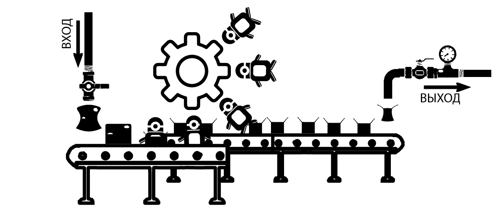

<h3 align="center">Конвейерное управление Миньонами 
Или скорее модель конвейерного управления Горутинами </h3>
<h1 align="center"> Конвейер и Миньоны</h1>

  

**Термины**

Конвейр – Отредактированная под свою задачу библиотека конвейерного управления Горутинами, представленная в данной теме.

Миньон – Горутина, которая выполняет полезную нагрузку в конвейере.

**Где это может использоваться**

- В высоконагруженных средах, где постоянно поступают запросы и их нужно обрабатывать сложной логикой.
- В ETL процессах, трансформации данных при загрузке или просто загрузки
- В участках кода для гибкого распределения ресурсов в многоядерной системе, контролируя количество рутин для каких-либо операций
- Для всего, что можно распоточить, поток данных, запросов, всего что можно передать в канал.

**Как это работает**

Пример простой задачи:

1. Первый модуль может принимать может не принимать на вход канал, а данные читать с CSV, проводит приведение к типам, и отправляет в выходной канал.
2. Открываем второй модуль, в котором на вход приходит выходной канал сток с первого.

Начинается процесс хеширования и схлопывания и отправляем новый тип данных в выходной канал.

1. Открываем третий конвейер, на вход принимаем канал второго, и делаем вставку приходящих данных в базу.

Но для чего это спросите вы, не проще ли все это делать в теле одной функции?

Возможно, проще. Но 2-й конвейер тяжеловесный. Если в нем будет мало миньонов, то процесс будет медленным, а если много, то гонки за файл. Да и при в сем при этом еще надо открывать транзакцию, чтобы вставить потом это в базу. Весь этот процесс в одной функции будет медленным. А при таком подходе мы задаем дну рутину (миньона) в первом, 8-мь во втором и два-три на вставку. Таким образом каждый конвейер занимается своим делом и идет правильное распределение задач.

Зачем такая большая обертка?

Для управления такой большой армией конвейеров с армией миньонов. Данная реализация выполняет следующие функции:

- Принимает команды на завершение работы всего конвейера.

Миньоны могут стоять без дела и ждать работы, это нормально. Вдруг предыдущий конвейер не поспевает за скоростью, для этого есть специальная проверка после каждой остановки потока, если работа не закончилась, вся армия не пойдет отдыхать.

- Исключает проблемы с гонками внутри объекта.
- Дает возможность с легкостью добавить нового рабочего в строй и у него будет свой номер.
- Делает не сложным процесс и убирание лишних миньонов, а это уже возможность динамического распределения ресурсов.
- Ассортимент инструментов завершения конвейера.

Асинхронный, синхронный, с сигналом завершения, количество сигналов если выходных каналов больше, без сигнала.
