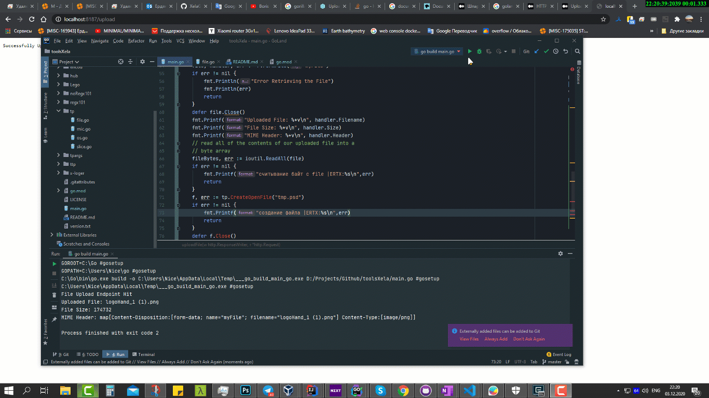

# HulyTTP - Huly ty tut polzaesh
## Http инструменты

- Resp  
Возвращаем rest ответ в стандартизированном варианте Notify
#### Пример
```go
import "github.com/xela07ax/toolsXela/hulyttp"
func sendMsg(w http.ResponseWriter, r *http.Request) {
	hulyttp.resp(w,r,"SendMsgNm", "Hello World", 0, true)
}
```
``
{"FuncName":"SendMsgNm","Text":"Hello World",Status":0,"Show":true,"UpdNum":0}
``
- Upload file

curl http://localhost:8187/upload -F "fileupload=@README.md" -vvv
curl http://localhost:8187/upload -F "fileupload=@logerWsWepPage-2.mp4" -vvv

Источник: https://stackoverflow.com/questions/40684307/how-can-i-receive-an-uploaded-file-using-a-golang-net-http-server

## Upload file
`еще примеры в папке _res*`
```go
	http.HandleFunc("/upload", func (w http.ResponseWriter, r *http.Request) {
		fmt.Println("File Upload Endpoint Hit")
		dat, err := ttp.UploadFileBytes(w,r)
		if err != nil {
			ertx:= fmt.Sprintf("файл не скачан |ertx:%s",err)
			http.Error(w, ertx, http.StatusBadGateway)
			fmt.Print(ertx)
			return
		}
```
### Демонстрация
